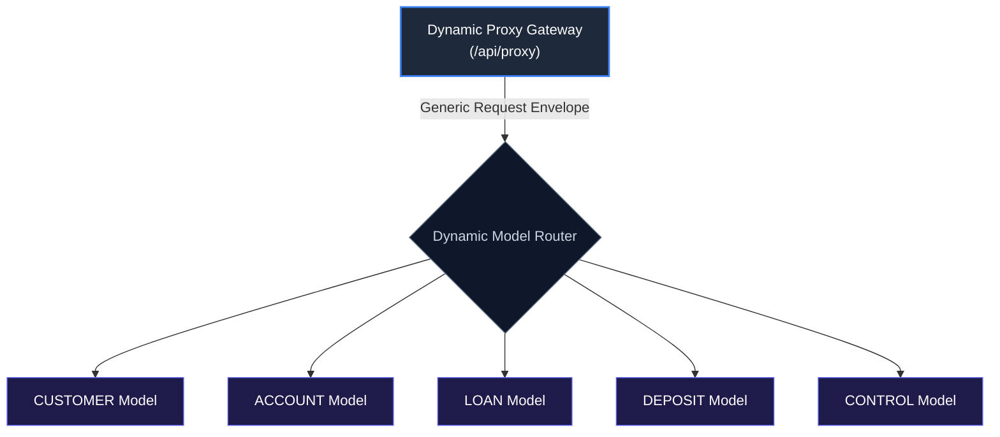

# 🌐 Dynamic API Integration & Generic Model Architecture

## 1. Executive Summary & Purpose
This document specifies the Dynamic API Integration architecture for Janata CBS Core Banking Workbench (`finx-ui`).

Instead of exposing thousands of individual REST endpoints for every banking model (Customer, Account, Loan, Deposit, General Ledger), the core backend exposes a unified **Dynamic API**. One generic request envelope handles queries, mutations, authorization workflows, and dynamic UI schema definitions across all core banking models.

---

## 2. Dynamic Model Architecture & Unified Routing



---

## 3. Record Functions (`recordFunction`)

Dynamic operations specify the exact database action using standard single-character record function codes:

| Code | Function Name | Description |
| :--- | :--- | :--- |
| `S` | **Select / Query** | Retrieves model details or inquiry record sets. |
| `M` | **Mutate / Update** | Submits form field updates or creates new entity drafts. |
| `A` | **Authorize** | Approves pending transactions (Maker-Checker workflow). |
| `D` | **Delete / Deactivate** | Soft deletes or deactivates target record instances. |

---

## 4. Generic Response Envelope Contract (`APIResponse<T>`)

All Dynamic API operations return a standardized response envelope defined in [src/types/index.ts](file:///d:/Work/React/cbs/finx-ui/src/types/index.ts):

```typescript
export interface APIResponse<T = unknown> {
  status: "SUCCESS" | "FAIL" | "ERROR";
  statusCode: number;
  message: string;
  timestamp: string;
  data?: T;
  errorCode?: string;
  validationErrors?: Record<string, string[]>;
}
```

---

## 5. Architectural Invariants & Rules

### Mandatory Rules (MUST)
- **MUST** parse dynamic data objects against Zod model validation schemas before processing.
- **MUST** handle `status === "FAIL"` or `status === "ERROR"` by surfacing localized error alerts via `useAlertStore`.

---

## 6. Verification Criteria

To verify Dynamic API type definitions:
```bash
pnpm typecheck
pnpm lint
```

---

## 7. Affected Documentation Updates
When modifying Dynamic API contracts, update:
- [docs/04-data-flow-and-api/dynamic-api-integration.md](file:///d:/Work/React/cbs/finx-ui/docs/04-data-flow-and-api/dynamic-api-integration.md)
- [docs/04-data-flow-and-api/grpc-and-bff-proxy.md](file:///d:/Work/React/cbs/finx-ui/docs/04-data-flow-and-api/grpc-and-bff-proxy.md)
