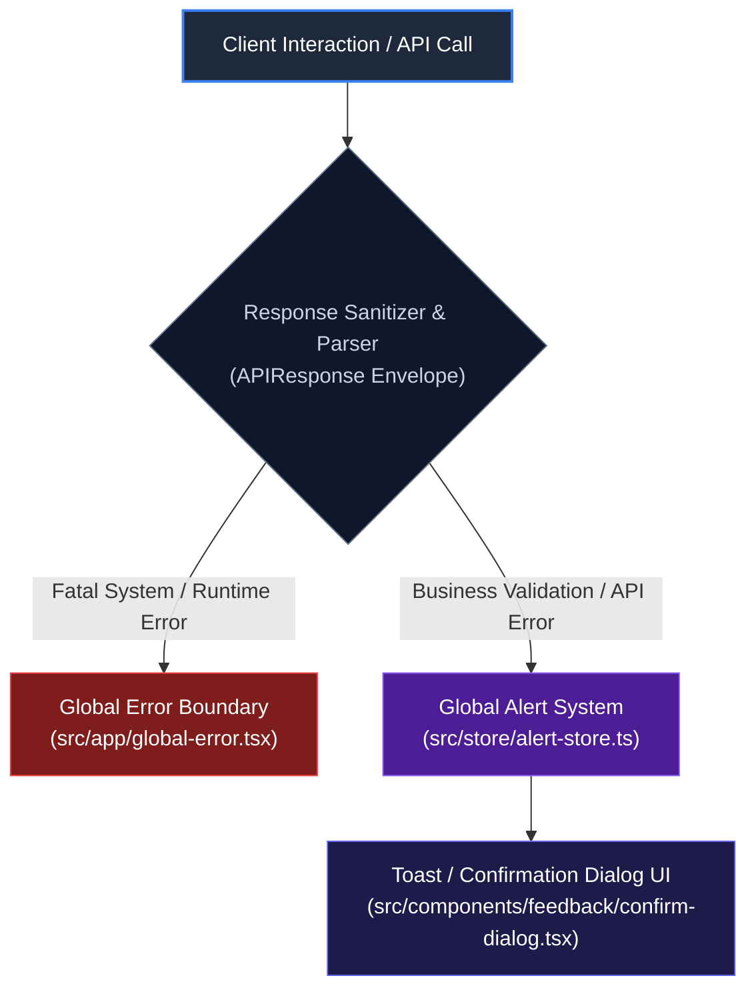

# 🚨 Error Handling, Circuit Breakers & Global Alerts

## 1. Executive Summary & Purpose
This document specifies the error handling, status code mapping, circuit breaker degradation, and global user feedback systems for `finx-ui`.

In core banking workflows, error states must be handled predictably. Silent failures, unhandled promise rejections, or raw stack traces displayed to banking officers are unacceptable. Errors are captured, sanitized, mapped to human-readable error messages, and surfaced via the global alert system.

---

## 2. Error Boundary Architecture



---

## 3. Global Alert & Modal State (`useAlertStore`)

Global notifications and confirmation dialogs are managed outside the React render tree via `useAlertStore` located at [src/store/alert-store.ts](file:///d:/Work/React/cbs/finx-ui/src/store/alert-store.ts).

### Alert Types
- **`showAlert({ title, message, variant: "destructive" })`:** Displays modal error message to officer.
- **`showConfirm({ title, message, onConfirm })`:** Prompts teller confirmation prior to high-risk transactions (e.g., account closing, high-value transfers).

---

## 4. Architectural Rules (MUST / MUST NOT)

### Mandatory Rules (MUST)
- **MUST** sanitize error messages before presenting to users to ensure internal database stack traces are never exposed to browser UI.
- **MUST** wrap async client proxy dispatches in `try/catch` blocks.
- **MUST NOT** swallow exceptions silently without notifying the user or logging the error event on the server.

---

## 5. Verification Criteria

To verify error handling:
```bash
pnpm typecheck
pnpm lint
```

---

## 6. Affected Documentation Updates
When modifying error handling or alert stores, update:
- [docs/04-data-flow-and-api/error-handling-and-alerts.md](file:///d:/Work/React/cbs/finx-ui/docs/04-data-flow-and-api/error-handling-and-alerts.md)
- [docs/01-architecture/code-review-standards.md](file:///d:/Work/React/cbs/finx-ui/docs/01-architecture/code-review-standards.md)
