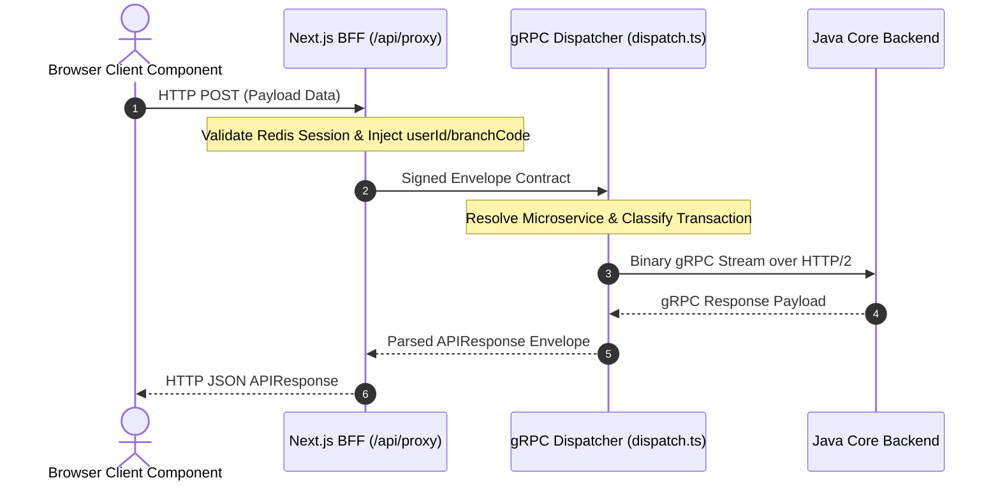

# 🔌 gRPC & BFF Proxy API Architecture

## 1. Executive Summary & Purpose
This document specifies the architecture, envelope format, authorization checks, and gRPC translation logic for the central Backend-for-Frontend (BFF) proxy gateway at [src/app/api/proxy/route.ts](file:///d:/Work/React/cbs/finx-ui/src/app/api/proxy/route.ts).

In Janata CBS, client components in the browser **MUST NEVER** communicate directly with internal Java Core gRPC services. All HTTP requests from the browser route to `/api/proxy`. The Next.js server validates officer session credentials, constructs a signed gRPC request envelope, and dispatches the payload to the backend over gRPC via [src/lib/grpc/dispatch.ts](file:///d:/Work/React/cbs/finx-ui/src/lib/grpc/dispatch.ts).

---

## 2. Request Dispatch Flow & Envelope Contract



---

## 3. Envelope Contract (`Envelope`)

Every payload dispatched from `/api/proxy` to `dispatch.ts` is formatted into a standardized `Envelope` object:

```typescript
interface Envelope {
  servicePath: string;     // Target microservice path (e.g., 'customer', 'account', 'default')
  requestType: string;     // Action command (e.g., 'INQ', 'GMC', 'MUTATE')
  controlName: string;     // Control module or sub-action name
  branchCode: string;      // Officer active branch code (injected from session)
  recordFunction: string;  // Database operation function ('S' = Select, 'M' = Mutate, 'A' = Authorize)
  recordId: string;        // Target record identifier
  authLevel: number;       // Officer authorization level
  userId: string;          // Authenticated officer ID (injected from session)
  clientId: string;        // Fixed identifier ('WEB-CLIENT')
  data: Record<string, unknown>; // Payload body data object
}
```

---

## 4. Architectural Rules (MUST / MUST NOT)

### Mandatory Rules (MUST)
- **MUST** validate user session via `getSession()` at the beginning of `/api/proxy`. Return `HTTP 401 Unauthorized` if session is missing or expired.
- **MUST** inject `userId` and `branchCode` into the envelope strictly from validated server session metadata, ignoring unverified client claims.
- **MUST** route all client backend calls through `/api/proxy` or Server Actions (`"use server"`).

### Prohibited Rules (MUST NOT)
- **MUST NOT** expose raw gRPC ports, protobuf definitions, or backend host credentials directly to browser clients.
- **MUST NOT** bypass session validation for transactional payload requests.

---

## 5. Error Handling & Status Code Mapping

| Error Condition | HTTP Status Code | Response Envelope Status | Message |
| :--- | :--- | :--- | :--- |
| Missing / Expired Session | `401 Unauthorized` | `FAIL` | "User session expired or unauthorized" |
| Missing `requestType` in body | `400 Bad Request` | `FAIL` | "Request type is missing in proxy payload" |
| Backend gRPC Transport Failure | `500 Internal Error` | `ERROR` | "Internal Proxy Dispatch Error" |
| Successful Backend Call | `200 OK` | `SUCCESS` | Dynamic backend payload |

---

## 6. Verification Criteria

To verify `/api/proxy` functionality:
```bash
# Typecheck proxy route handler and dispatch stubs
pnpm typecheck

# Lint check API proxy route
pnpm lint
```

---

## 7. Affected Documentation Updates
When modifying proxy route handlers or envelope contracts, update:
- [docs/04-data-flow-and-api/grpc-and-bff-proxy.md](file:///d:/Work/React/cbs/finx-ui/docs/04-data-flow-and-api/grpc-and-bff-proxy.md)
- [docs/01-architecture/overview.md](file:///d:/Work/React/cbs/finx-ui/docs/01-architecture/overview.md)
- [docs/01-architecture/security-and-secrets.md](file:///d:/Work/React/cbs/finx-ui/docs/01-architecture/security-and-secrets.md)
