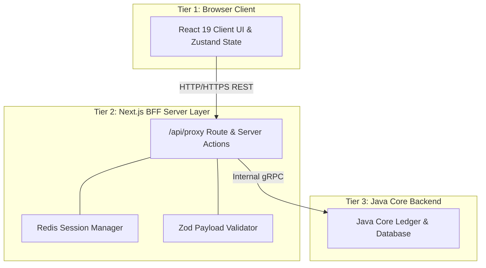

# 🏛️ System Topology & Core Banking BFF Architecture

## 1. Executive Summary & Purpose
This document defines the high-level system topology, security boundaries, and communication flow for the Janata CBS Core Banking Workbench (`finx-ui`). 

This project acts strictly as the **Presentation Layer and Backend-for-Frontend (BFF)** for the Java Core Banking Engine. It provides a dynamic, schema-driven user interface for banking officers and administrators without exposing backend databases or gRPC transport mechanisms directly to the browser.

---

## 2. 3-Tier Core Banking Boundary Topology



---

## 3. Tier Responsibilities & Boundaries

### Tier 1: Browser Client (UI Layer)
- **Source of Truth:** User input state, UI active tabs (`useWorkbenchStore`), dynamic form field values, and transient modal dialogs.
- **Dependencies:** `@tanstack/react-table`, `zustand`, `lucide-react`, `tailwindcss v4`.
- **MUST NOT:** 
  - Import `@grpc/grpc-js`, `ioredis`, `ts-proto`, or any server-only modules.
  - Access environment variables missing the `NEXT_PUBLIC_` prefix.
  - Make direct HTTP calls to external Java Core gRPC endpoints.
  - Execute core banking transaction calculations or ledger mutations locally.

### Tier 2: Next.js BFF Server Layer (Gateway & Middleware)
- **Source of Truth:** Session verification, request dispatching, Redis caching, gRPC client pool lifecycle, and Zod boundary validation.
- **Dependencies:** `import "server-only"`, `@grpc/grpc-js`, `ioredis`, `zod`.
- **MUST:**
  - Enforce `import "server-only"` on top of all files in [src/lib/core/](file:///d:/Work/React/cbs/finx-ui/src/lib/core).
  - Intercept all browser requests via `/api/proxy` or marked Server Actions (`"use server"`).
  - Validate and sanitize payloads using Zod schemas in [src/lib/schema/](file:///d:/Work/React/cbs/finx-ui/src/lib/schema) before sending over gRPC.
  - Inject officer credentials, branch context, and authorization tokens into gRPC metadata headers.

### Tier 3: Java Core Backend
- **Source of Truth:** Account balances, general ledger state, database persistence, transaction settlement, and GMC form schema configurations.
- **Boundary:** Isolated behind internal network interfaces. Communicates solely via gRPC defined in [proto/service.proto](file:///d:/Work/React/cbs/finx-ui/proto/service.proto).

---

## 4. Architectural Invariants & Rules

### Mandatory Rules (MUST)
1. **MUST** route all client backend requests through [src/app/api/proxy/route.ts](file:///d:/Work/React/cbs/finx-ui/src/app/api/proxy/route.ts) or Server Actions.
2. **MUST** protect server-side utilities with `import "server-only"`.
3. **MUST** validate incoming payloads via Zod before gRPC conversion.
4. **MUST NOT** expose gRPC connection strings or Redis credentials to client bundles.
5. **MUST NOT** allow direct database drivers or gRPC transport packages in client-side bundles.

---

## 5. Security & Sensitive-Data Handling

- **Authentication Tokens:** Officer session keys are stored in HTTP-only, secure, samesite cookies.
- **Session Caching:** Session state is managed via `ioredis` in [src/lib/core/redis-session.ts](file:///d:/Work/React/cbs/finx-ui/src/lib/core/redis-session.ts) with sliding expiry.
- **Fail-Open Circuit Breaker:** If Redis is unreachable, session/cache retrieval fails open to query the Java Core directly without interrupting critical teller workflows.

---

## 6. Verification Criteria & Testing

To verify architectural compliance:
```bash
# Verify no server-only leaks in client components
pnpm build

# Ensure zero TypeScript 'any' violations and boundary errors
pnpm typecheck

# Lint check for imported dependencies
pnpm lint
```

---

## 7. Affected Documentation Updates
When modifying the system topology or network interfaces, the following files MUST be updated:
- [docs/01-architecture/overview.md](file:///d:/Work/React/cbs/finx-ui/docs/01-architecture/overview.md)
- [docs/04-data-flow-and-api/grpc-and-bff-proxy.md](file:///d:/Work/React/cbs/finx-ui/docs/04-data-flow-and-api/grpc-and-bff-proxy.md)
- [README.md](file:///d:/Work/React/cbs/finx-ui/README.md)
