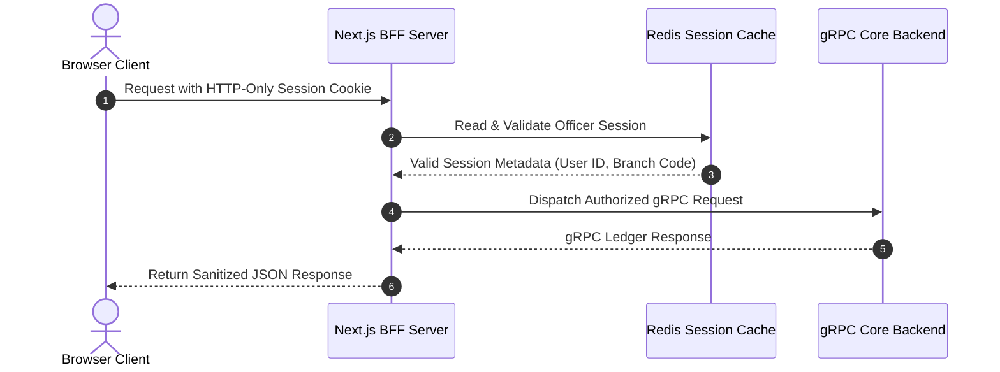

# 🔒 Security, Authorization & Server Boundaries

## 1. Executive Summary & Purpose
This document defines the security architecture, authorization controls, secret isolation rules, and server-client boundary enforcement for the Janata CBS Core Banking Workbench (`finx-ui`).

In a core banking environment, frontend code runs in an untrusted browser environment. Therefore, zero trust is extended to the client. All sensitive operations, credentials, session validations, and gRPC backend channels MUST be executed and authorized exclusively within the Next.js server context.

---

## 2. Server Boundary Enforcement (`import "server-only"`)

### The `server-only` Guard Rule
All files residing in [src/lib/core/](file:///d:/Work/React/cbs/finx-ui/src/lib/core) and server infrastructure utilities **MUST** contain the following import on Line 1:

```typescript
import "server-only";
```

### Affected Server Infrastructure Modules
- `src/lib/core/grpc.ts` (gRPC channel creation & connection pooling)
- `src/lib/core/redis-client.ts` (ioredis connection pool & circuit breaker)
- `src/lib/core/redis-session.ts` (Cookie decryption & session validation)
- `src/lib/core/dispatch.ts` (Dynamic backend command dispatcher)
- `src/lib/core/rate-limit.ts` (IP-based login rate limiter)

### Enforcement Mechanism
If any client component (`"use client"`) or client-imported module attempts to import a file containing `import "server-only"`, the Next.js build process will immediately halt with a compilation error.

---

## 3. Secret Isolation & Environment Variables

- **Server-Only Secrets:** Environment variables such as `REDIS_URL`, `GRPC_BACKEND_URL`, and session signing keys **MUST NOT** be prefixed with `NEXT_PUBLIC_`.
- **Client-Safe Variables:** Only non-sensitive runtime flags (e.g., `NEXT_PUBLIC_BASE_URL`, `NEXT_PUBLIC_LOGOUT_TIME`) may use the `NEXT_PUBLIC_` prefix.
- **Validation:** Environment variables are validated on server startup using Zod in `src/lib/config/env.ts`.

---

## 4. Session Authorization & Token Lifecycle



### Authorization Requirements
1. **Opaque HTTP-Only Cookies:** Session tokens are stored in browser cookies marked `HttpOnly`, `Secure`, and `SameSite=Strict`. JavaScript running in the browser cannot read or mutate session cookies directly.
2. **Server-Side Verification:** The BFF proxy at `src/app/api/proxy/route.ts` retrieves the session cookie, verifies its existence against Redis (`redis-session.ts`), and extracts the user context before dispatching any gRPC request.
3. **UI vs Server Authorization:** Disabling or hiding a button in the UI is purely a user-experience enhancement. **Server-side authorization checks MUST always validate permissions at the BFF boundary**, regardless of UI state.

---

## 5. Security Rules (MUST / MUST NOT)

### Mandatory Rules (MUST)
- **MUST** include `import "server-only"` on Line 1 of all server infrastructure files.
- **MUST** sanitize and parse all client payloads using Zod schemas prior to backend dispatch.
- **MUST** validate session authorization on every `/api/proxy` request.
- **MUST** set `HttpOnly` and `SameSite=Strict` flags on session cookies.

### Prohibited Rules (MUST NOT)
- **MUST NOT** import `@grpc/grpc-js`, `ts-proto`, or `ioredis` in any client component (`"use client"`).
- **MUST NOT** pass raw, unvalidated client inputs directly to gRPC stubs.
- **MUST NOT** store private encryption keys or database secrets in repository code or client-accessible variables.
- **MUST NOT** rely solely on client-side state or UI visibility for access control decisions.

---

## 6. Verification Criteria

To verify security boundary compliance:
```bash
# Verify no server-only modules leak to the browser client bundle
pnpm build

# Run linting to check for missing guards and forbidden imports
pnpm lint
```

---

## 7. Affected Documentation Updates
When modifying authorization rules or session management, update:
- [docs/01-architecture/security-and-secrets.md](file:///d:/Work/React/cbs/finx-ui/docs/01-architecture/security-and-secrets.md)
- [docs/04-data-flow-and-api/grpc-and-bff-proxy.md](file:///d:/Work/React/cbs/finx-ui/docs/04-data-flow-and-api/grpc-and-bff-proxy.md)
