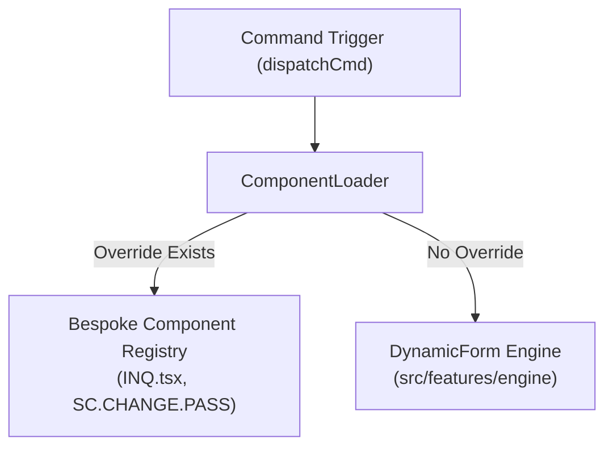

# 🧩 Component Loader & Pop-Out Window Manager Architecture

## 1. Executive Summary & Purpose
This document specifies the architecture, resolution flow, and lifecycle management for the `ComponentLoader` and pop-out window subsystem in `finx-ui`.

The `ComponentLoader` serves as the single unified component resolution registry, replacing legacy multi-loader patterns. It dynamically resolves whether a requested banking screen command should render via a custom React component override or fall back to the generic `DynamicForm` engine.

---

## 2. Dynamic Resolution & Load Flow



---

## 3. Pop-Out Window Mode Architecture (`window` vs `panel`)

Banking officers can operate screens in two distinct display modes:
1. **`panel` Mode (Internal Workspace Tabs):** The screen renders inside the main dashboard tab bar (`AppTabbar`). State is held in `useWorkbenchStore`.
2. **`window` Mode (Browser Pop-Out Windows):** The screen launches in a detached browser window via `open-component-window.ts`.

### Smart Instance Reuse Algorithm
When a user launches a command in `window` mode:
1. `open-component-window.ts` queries the active window map in `useWorkbenchStore`.
2. **If window instance exists:** It calls `window.focus()` on the existing reference, preventing duplicate window spawns.
3. **If window does not exist:** It opens a new popup window with high-density workspace URL params (`/screen/[id]?mode=window`).

---

## 4. Architectural Invariants & Rules

### Mandatory Rules (MUST)
- **MUST** route all dynamic component loading through `src/features/workspace/components/component-loader.tsx`.
- **MUST** register bespoke screen overrides in the central `ComponentRegistry`.
- **MUST** focus existing pop-out window instances rather than spawning duplicate popup windows for the same command ID.

### Prohibited Rules (MUST NOT)
- **MUST NOT** instantiate parallel loader components or resurrect legacy triple-loader patterns.
- **MUST NOT** hardcode direct component imports inside generic layout shells.

---

## 5. Verification & Extension Instructions

### Registering a New Custom Bespoke Screen Override
1. Build custom React component in `src/features/<domain>/components/my-custom-screen.tsx`.
2. Add command entry to `ComponentRegistry` in [src/features/workspace/components/component-loader.tsx](file:///d:/Work/React/cbs/finx-ui/src/features/workspace/components/component-loader.tsx):
   ```typescript
   "MY.CUSTOM.CMD": lazy(() => import("@/features/my-domain/components/my-custom-screen"))
   ```
3. Test loading via command executor and run `pnpm typecheck`.

---

## 6. Affected Documentation Updates
When modifying component resolution or window launcher utilities, update:
- [docs/02-core-engine/component-loader.md](file:///d:/Work/React/cbs/finx-ui/docs/02-core-engine/component-loader.md)
- [docs/03-domain-features/workspace-and-windows.md](file:///d:/Work/React/cbs/finx-ui/docs/03-domain-features/workspace-and-windows.md)
