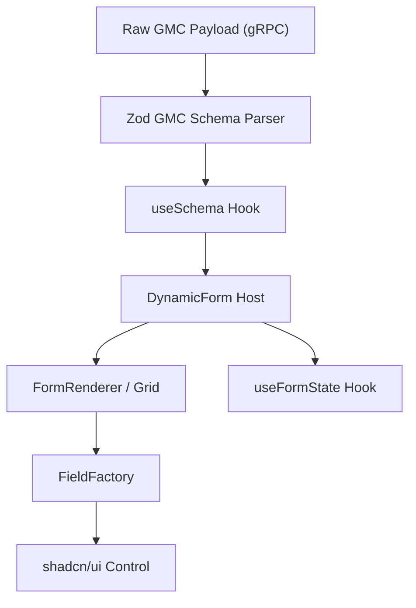

# ⚙️ Form Rendering Pipeline Architecture

## 1. Executive Summary & Purpose
This document details the lifecycle, execution flow, state management, and component architecture of the Dynamic Form Rendering Pipeline in `finx-ui`.

The engine transforms parsed GMC model schemas into interactive, high-density React form controls, handling form state sync, validation, auto-calculations, and submission to the backend.

---

## 2. Rendering Pipeline Architecture

---

## 3. Pipeline Component Responsibilities

### 1. `useSchema` ([src/features/engine/hooks/use-schema.ts](file:///d:/Work/React/cbs/finx-ui/src/features/engine/hooks/use-schema.ts))
- **Role:** Fetches and parses the GMC model schema for a given command ID.
- **State Ownership:** Manages schema loading, error state, and schema cache invalidation.

### 2. `DynamicForm` ([src/features/engine/components/dynamic-form.tsx](file:///d:/Work/React/cbs/finx-ui/src/features/engine/components/dynamic-form.tsx))
- **Role:** Top-level host component for form rendering.
- **State Ownership:** Instantiates `useFormState`, manages form draft preservation in Zustand tab state (`useWorkbenchStore`), and handles submit button actions.

### 3. `FormRenderer` ([src/features/engine/components/form-renderer.tsx](file:///d:/Work/React/cbs/finx-ui/src/features/engine/components/form-renderer.tsx))
- **Role:** Computes 12-column grid container layout (`grid grid-cols-12 gap-3`).
- **Responsibility:** Maps schema fields into grid cells and delegates rendering to `FieldFactory`.

### 4. `FieldFactory` ([src/features/engine/components/field-factory.tsx](file:///d:/Work/React/cbs/finx-ui/src/features/engine/components/field-factory.tsx))
- **Role:** Pure control lookup factory.
- **Responsibility:** Maps field types (`text`, `select`, `date`, `number`) to low-level primitive design tokens in `src/components/ui/`.

---

## 4. Pipeline Rules & Best Practices

### Mandatory Rules (MUST)
- **MUST** encapsulate all control rendering inside `FieldFactory`.
- **MUST** isolate dynamic field state inside `useFormState` hook.
- **MUST** keep `FieldFactory` and `FormRenderer` files strictly under **300 lines**.

### Prohibited Rules (MUST NOT)
- **MUST NOT** mutate global window state directly within field change handlers.
- **MUST NOT** trigger direct backend mutations without validating input data via Zod.

---

## 5. Verification & Extension Instructions

### Adding a New Custom Field Control
1. Update `FieldType` enum in [src/features/engine/types.ts](file:///d:/Work/React/cbs/finx-ui/src/features/engine/types.ts).
2. Add control matching branch in [field-factory.tsx](file:///d:/Work/React/cbs/finx-ui/src/features/engine/components/field-factory.tsx).
3. Import required primitive token from `src/components/ui/`.
4. Run `pnpm typecheck` to verify complete control coverage.

---

## 6. Affected Documentation Updates
When modifying rendering pipeline components, update:
- [docs/02-core-engine/form-rendering-pipeline.md](file:///d:/Work/React/cbs/finx-ui/docs/02-core-engine/form-rendering-pipeline.md)
- [docs/02-core-engine/gmc-schema-spec.md](file:///d:/Work/React/cbs/finx-ui/docs/02-core-engine/gmc-schema-spec.md)
