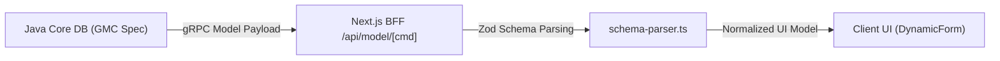

# 📋 Dynamic GMC Payload & Schema Specification

## 1. Executive Summary & Purpose
This document specifies the format, structure, and validation rules for General Model Configuration (`GMC`) payloads in the Janata CBS Core Banking Workbench (`finx-ui`).

In Janata CBS, UI forms are not statically hardcoded. The backend database returns dynamic `GMC` model definitions over gRPC. The engine in [src/features/engine/](file:///d:/Work/React/cbs/finx-ui/src/features/engine) parses these raw backend payloads via Zod, normalizes control specifications, and computes a responsive 12-column form grid.

---

## 2. Source-of-Truth & Data Lifecycle



1. **Source-of-Truth:** Java Core Backend database model configuration table.
2. **BFF Fetcher:** [src/lib/schema/get-model.ts](file:///d:/Work/React/cbs/finx-ui/src/lib/schema/get-model.ts) or `src/app/api/model/[cmd]/route.ts`.
3. **Parser & Normalizer:** [src/features/engine/schema/schema-parser.ts](file:///d:/Work/React/cbs/finx-ui/src/features/engine/schema/schema-parser.ts) using Zod definitions in [src/features/engine/schema/schemas.ts](file:///d:/Work/React/cbs/finx-ui/src/features/engine/schema/schemas.ts).
4. **Render Consumer:** [src/features/engine/components/dynamic-form.tsx](file:///d:/Work/React/cbs/finx-ui/src/features/engine/components/dynamic-form.tsx).

---

## 3. GMC Payload Schema & Grid Rules

### Payload Structure
A valid `GMC` schema consists of:
- **`modelName` / `command`:** Unique identifier (e.g. `CUSTOMER.CREATE`, `ACCOUNT.OPEN`).
- **`title`:** Human-readable form title displayed in section header.
- **`fields`:** Array of field control definitions.

### Field Control Attributes
| Attribute | Type | Description |
| :--- | :--- | :--- |
| `name` | `string` | Unique field identifier key in form state payload. |
| `label` | `string` | User-facing control label text. |
| `type` | `text \| number \| select \| date \| checkbox \| textarea` | Control renderer type. |
| `required` | `boolean` | Indicates if field validation requires non-empty value. |
| `colSpan` | `1..12` | Grid width span out of 12 columns. Default is 12 if unspecified. |
| `options` | `{ label: string, value: string }[]` | Select options (for `select` type). |
| `defaultValue` | `string \| number \| boolean` | Initial default value. |

### 12-Column Responsive Grid Math
Dynamic form layouts calculate control widths using standard 12-column grid spans:
- `colSpan = 12` $\rightarrow$ Full-width row (`col-span-12`).
- `colSpan = 6` $\rightarrow$ Half-width control (`sm:col-span-6`).
- `colSpan = 4` $\rightarrow$ One-third width control (`sm:col-span-4`).
- `colSpan = 3` $\rightarrow$ One-quarter width control (`sm:col-span-3`).

---

## 4. Architectural Invariants & Rules

### Mandatory Rules (MUST)
- **MUST** parse raw GMC payloads using `gmcSchema.parse(data)` before passing to rendering components.
- **MUST** fallback gracefully to default text controls when encountering unrecognized field types.
- **MUST** sanitize user input in controls using Zod type coercions before submitting.

### Prohibited Rules (MUST NOT)
- **MUST NOT** render unvalidated raw JSON strings directly into form controls without Zod schema parsing.
- **MUST NOT** hardcode static field pixel widths (`width: 340px`) instead of dynamic grid column spans (`col-span-*`).

---

## 5. Security & Sensitive Field Masking

- **Sensitive Fields:** Account numbers, national ID numbers, and security passcodes MUST specify `type: "password"` or mask controls appropriately in [field-factory.tsx](file:///d:/Work/React/cbs/finx-ui/src/features/engine/components/field-factory.tsx).
- **Sanitization:** All text inputs sanitize HTML tags to prevent XSS attacks when rendering dynamic labels.

---

## 6. Verification Criteria

To verify GMC schema parsing:
```bash
# Typecheck engine schema definitions
pnpm typecheck

# Verify engine tests and schema parsing
pnpm lint
```

---

## 7. Affected Documentation Updates
When modifying GMC schema definitions or grid rules, update:
- [docs/02-core-engine/gmc-schema-spec.md](file:///d:/Work/React/cbs/finx-ui/docs/02-core-engine/gmc-schema-spec.md)
- [docs/02-core-engine/form-rendering-pipeline.md](file:///d:/Work/React/cbs/finx-ui/docs/02-core-engine/form-rendering-pipeline.md)
