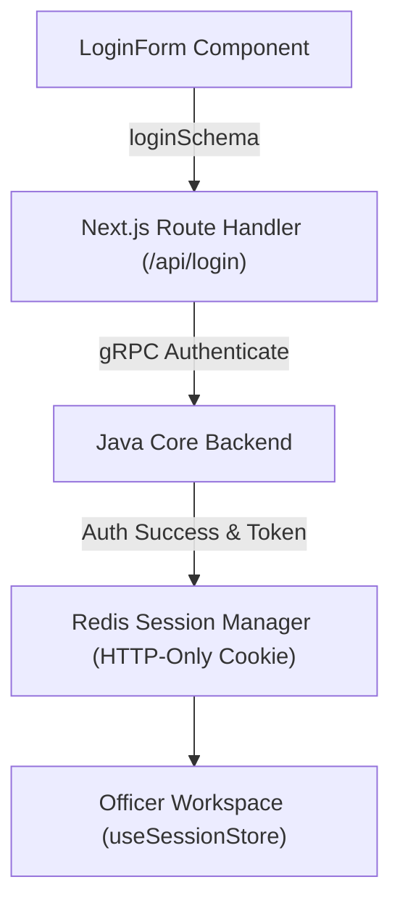

# 🔐 Authentication & Session Domain Architecture

## 1. Executive Summary & Purpose
This document specifies the architecture, data flow, state ownership, and security constraints of the Authentication & Session feature module in `finx-ui` located at [src/features/auth/](file:///d:/Work/React/cbs/finx-ui/src/features/auth).

This domain handles banking officer authentication, first-time mandatory password change workflows (`SC.CHANGE.PASS.tsx`), sliding-expiry Redis session management, and branch switching authorization.

---

## 2. Authentication Flow & Boundaries



---

## 3. Domain Components & Responsibilities

### 1. `LoginForm` ([src/features/auth/components/login-form.tsx](file:///d:/Work/React/cbs/finx-ui/src/features/auth/components/login-form.tsx))
- **Role:** Handles username, password, and branch selection inputs.
- **Validation:** Uses `loginSchema` in [src/features/auth/schemas.ts](file:///d:/Work/React/cbs/finx-ui/src/features/auth/schemas.ts).

### 2. `ChangePassword` ([src/features/auth/components/change-password.tsx](file:///d:/Work/React/cbs/finx-ui/src/features/auth/components/change-password.tsx))
- **Role:** Forces mandatory password updates for expired credentials or first-time officer logins.
- **Override Command:** Resolves custom screen override `SC.CHANGE.PASS.tsx` via `ComponentLoader`.

### 3. Server Actions & Session Store
- **Server Actions:** `logoutAction` and `changePasswordAction` in [src/features/auth/actions.ts](file:///d:/Work/React/cbs/finx-ui/src/features/auth/actions.ts).
- **Session State:** Managed on the client via `useSessionStore` in [src/store/session-store.ts](file:///d:/Work/React/cbs/finx-ui/src/store/session-store.ts).

---

## 4. Architectural Invariants & Rules

### Mandatory Rules (MUST)
- **MUST** parse credentials using `loginSchema` before dispatching to `/api/login`.
- **MUST** store session tokens strictly in `HttpOnly`, `SameSite=Strict` cookies.
- **MUST** clear client-side `useSessionStore` state immediately upon logout.

### Prohibited Rules (MUST NOT)
- **MUST NOT** store officer passwords or unencrypted tokens in browser `localStorage` or `sessionStorage`.
- **MUST NOT** perform client-side authentication bypass checks without server validation.

---

## 5. Security & Sensitive-Data Handling

- **Credential Transmission:** All passwords are submitted over TLS/HTTPS.
- **Masking:** Password input controls enforce `type="password"`.
- **Session Isolation:** Session cookies use sliding expiry refreshed automatically during active user requests via `redis-session.ts`.

---

## 6. Verification Criteria

To verify authentication functionality:
```bash
# Typecheck auth module schemas and actions
pnpm typecheck

# Lint check auth components
pnpm lint
```

---

## 7. Affected Documentation Updates
When modifying authentication logic or schemas, update:
- [docs/03-domain-features/auth-and-session.md](file:///d:/Work/React/cbs/finx-ui/docs/03-domain-features/auth-and-session.md)
- [docs/01-architecture/security-and-secrets.md](file:///d:/Work/React/cbs/finx-ui/docs/01-architecture/security-and-secrets.md)
