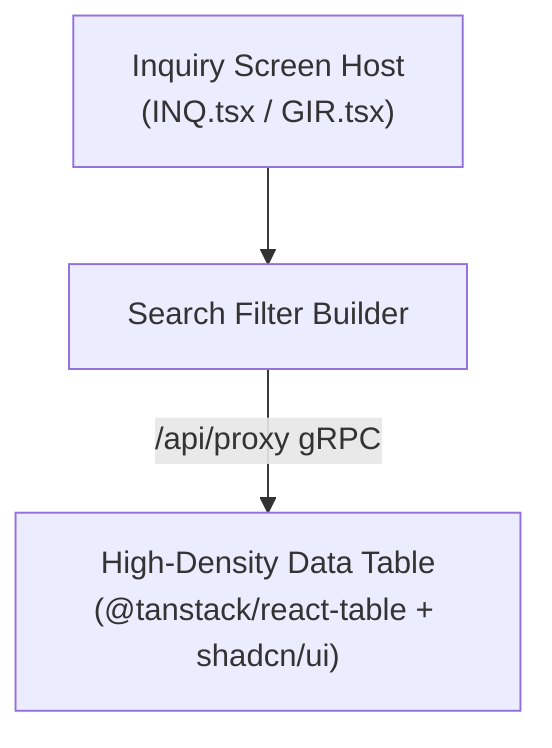

# 🔍 Inquiries Domain Architecture

## 1. Executive Summary & Purpose
This document specifies the architecture, data grid controls, search filter lifecycle, and bespoke screens for the Inquiries domain in `finx-ui` located at [src/features/inquiries/](file:///d:/Work/React/cbs/finx-ui/src/features/inquiries).

This feature manages generic and specialized inquiry screens (`INQ.tsx`, `GIR.tsx`, `SIR.tsx`), high-density data tables, search filter builders, and export utilities.

---

## 2. Inquiries Flow & Components



---

## 3. Key Components & Bespoke Overrides

- **`INQ.tsx`:** Standard Inquiry screen override handling query filter inputs and result rendering.
- **`GIR.tsx`:** General Inquiry Results screen handling multi-row tabular result sets.
- **`SIR.tsx`:** Specific Inquiry Results screen handling single-record detailed drill-down views.

---

## 4. Architectural Invariants & Rules

### Mandatory Rules (MUST)
- **MUST** render inquiry result tables using `@tanstack/react-table` combined with `shadcn/ui` table primitives.
- **MUST** format table header rows using natural uppercase styling (`<TableRow className="uppercase">`).
- **MUST NOT** load un-paginated result sets over 1,000 rows without server-side pagination headers.

---

## 5. Verification Criteria

To verify inquiry functionality:
```bash
# Typecheck inquiry schemas and components
pnpm typecheck

# Lint check inquiry domain files
pnpm lint
```

---

## 6. Affected Documentation Updates
When modifying inquiry screens or data tables, update:
- [docs/03-domain-features/inquiries.md](file:///d:/Work/React/cbs/finx-ui/docs/03-domain-features/inquiries.md)
- [docs/01-architecture/code-review-standards.md](file:///d:/Work/React/cbs/finx-ui/docs/01-architecture/code-review-standards.md)
