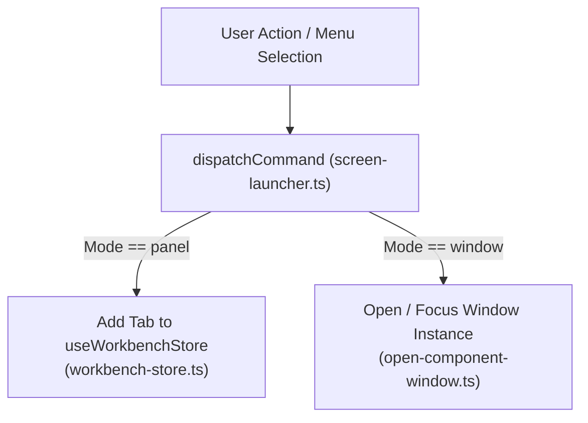

# 🖥️ Workspace & Window Management Domain Architecture

## 1. Executive Summary & Purpose
This document specifies the architecture, state management, tab lifecycle, and window pop-out manager of the Workspace feature module located at [src/features/workspace/](file:///d:/Work/React/cbs/finx-ui/src/features/workspace).

The workspace module manages officer navigation, dynamic tab switching (`panel` mode), browser pop-out windows (`window` mode), command execution, and navigation menu tree parsing (`MNU` schemas).

---

## 2. Command Execution & Workspace Flow



---

## 3. State Ownership & Tab Lifecycle

### Workspace State Store ([src/store/workbench-store.ts](file:///d:/Work/React/cbs/finx-ui/src/store/workbench-store.ts))
- **Active Tabs (`tabs`):** Array of open tab objects containing `id`, `title`, `command`, `mode`, and `draftState`.
- **Active Tab ID (`activeTabId`):** Id of the tab currently visible in the main panel.
- **Draft Preservation:** When switching between tabs, form input values are stored inside `tab.draftState` to prevent loss of uncommitted data.

### Menu Tree Parser ([src/features/workspace/menu/menu-parser.ts](file:///d:/Work/React/cbs/finx-ui/src/features/workspace/menu/menu-parser.ts))
- **Role:** Parses raw backend navigation payloads (`MNU` JSON) using Zod schemas in [schemas.ts](file:///d:/Work/React/cbs/finx-ui/src/features/workspace/menu/schemas.ts) into hierarchical sidebar items.

---

## 4. Architectural Invariants & Rules

### Mandatory Rules (MUST)
- **MUST** route all internal screen transitions through `dispatchCommand` / `screen-launcher.ts`.
- **MUST NOT** use Next.js `<Link>` tags for internal workbench screen navigation.
- **MUST** preserve uncommitted form drafts in `tab.draftState` during tab switches.

---

## 5. Verification Criteria

To verify workspace functionality:
```bash
# Typecheck workspace domain types and components
pnpm typecheck

# Lint check workspace module
pnpm lint
```

---

## 6. Affected Documentation Updates
When modifying workspace state or screen launching, update:
- [docs/03-domain-features/workspace-and-windows.md](file:///d:/Work/React/cbs/finx-ui/docs/03-domain-features/workspace-and-windows.md)
- [docs/02-core-engine/component-loader.md](file:///d:/Work/React/cbs/finx-ui/docs/02-core-engine/component-loader.md)
