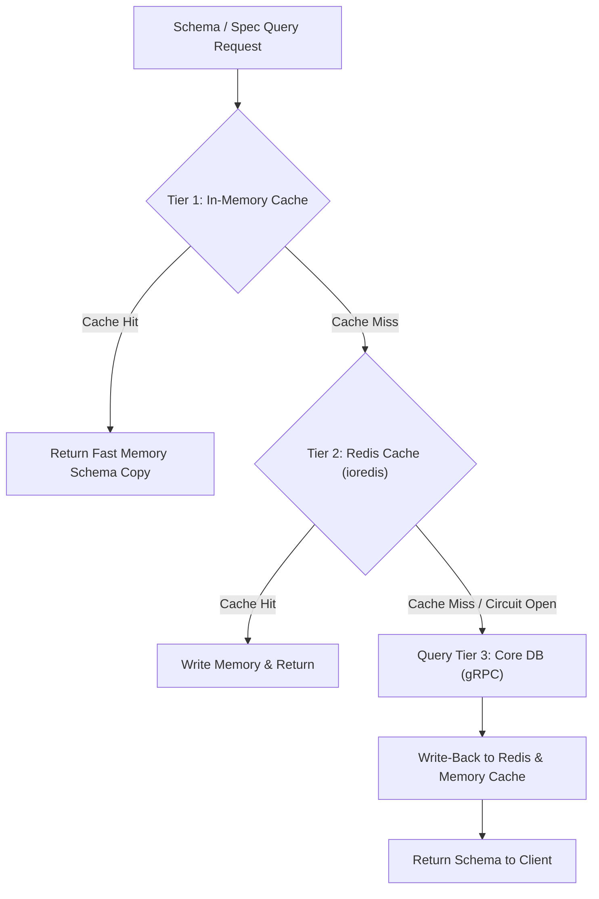

# ⚡ Multi-Layer Caching Strategy & Circuit Breaker

## 1. Executive Summary & Purpose
This document specifies the multi-layer caching architecture, Redis session storage, read-through cache flow, and fail-open circuit breaker mechanism in `finx-ui`.

To guarantee high performance and sub-millisecond dynamic schema rendering for banking officers, `finx-ui` implements a 3-tier read-through caching strategy. If the Redis cache layer experiences outages, a **fail-open circuit breaker** ensures requests fall straight through to the core backend without bringing teller screens offline.

---

## 2. Multi-Layer Caching Flow



---

## 3. Tier Responsibilities & Implementations

### Tier 1: Client / Server Memory Cache
- **Scope:** In-memory schema cache ([src/lib/core/cache.ts](file:///d:/Work/React/cbs/finx-ui/src/lib/core/cache.ts)).
- **Content:** GMC form specs, menu tree structures, and branch lists.
- **TTL:** Short window (5 minutes) or until explicitly invalidated.

### Tier 2: Redis Shared Cache (`ioredis`)
- **Scope:** Redis connection client ([src/lib/core/redis-client.ts](file:///d:/Work/React/cbs/finx-ui/src/lib/core/redis-client.ts)) and Redis session manager ([src/lib/core/redis-session.ts](file:///d:/Work/React/cbs/finx-ui/src/lib/core/redis-session.ts)).
- **Content:** Sliding officer sessions, branch metadata, GMC backend model schemas.
- **Fail-Open Circuit Breaker:** If Redis connection drops, the circuit breaker opens, suppressing Redis timeouts and allowing requests to query the Java Core directly.

### Tier 3: Java Core Backend Database
- **Scope:** Source-of-truth database accessible over gRPC.

---

## 4. Architectural Rules (MUST / MUST NOT)

### Mandatory Rules (MUST)
- **MUST** implement fail-open error handling around Redis calls so cache degradation never blocks critical core banking teller workflows.
- **MUST** include `import "server-only"` on Line 1 of `redis-client.ts` and `cache.ts`.
- **MUST** allow cache bypass in development when `CACHE_ENABLED=false` in `.env.local`.

---

## 5. Verification Criteria

To verify caching functionality:
```bash
# Typecheck cache modules
pnpm typecheck

# Lint check core caching layer
pnpm lint
```

---

## 6. Affected Documentation Updates
When modifying cache configuration or Redis integration, update:
- [docs/04-data-flow-and-api/caching-strategy.md](file:///d:/Work/React/cbs/finx-ui/docs/04-data-flow-and-api/caching-strategy.md)
- [README.md](file:///d:/Work/React/cbs/finx-ui/README.md)
